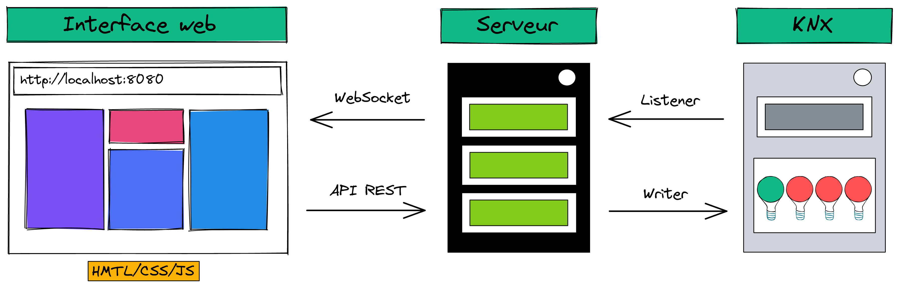

<h1>Projet RESIoT</h1>
<!-- TABLE OF CONTENTS -->
<details open="open">
  <summary><h2 style="display: inline-block">Table of Contents</h2></summary>
  <ol>
    <li><a href="#Présentation">Présentation</a></li>
    <li><a href="#Fonctionnalités">Fonctionnalités</a></li>
    <li><a href="#Installation et lancement du projet">Installation et lancement du projet</a></li>
    <li><a href="#Installation de l'application mobile">Installation de l'application mobile</a></li>
    <li><a href="#Architecture">Architecture</a></li>
    <li><a href="#Contact">Contact</a></li>
  </ol>
</details>

## Présentation

Sur un module d'une vingtaine d'heure, nous avons réalisé un projet en lien avec la spécialité Internet of Things. L'objectif du projet est, à partir d'une page Internet ou de boutons poussoirs, de piloter la maquette KNX qui commande 4 LED. 

Plusieurs étapes permettent de mener à bien le projet :
1. Choix des langages de programmation
2. Création d'un serveur web
3. Création d'une page web pour commander la maquette KNX
5. Communication client - serveur
6. Communication serveur - maquette KNX


## Fonctionnalités

Afin d'assurer un maximum d'intéraction entre l'utilisateur et l'interface web, nous avons développé des fonctionnalités :
1. Connexion - Déconnexion à la maquette
2. Allumer - Éteindre les LED
3. Changer le mode de fonctionnement (chenillard de gauche vers la droite et inversement, mode flipper et random)
4. Augmenter - Diminuer la vitesse

## Installation et lancement du projet

1. Cloner le répertoire
   ```sh
   git clone https://github.com/ESIR2-RESIoT/project.git
   ```
2. Ouvrir le répertoire avec IntelliJ
3. Ajouter une nouvelle configuration
4. Se connecter au routeur de la maquette KNX, puis lancer le serveur

## Installation de l'application mobile
Installer l'APK qui se trouve dans le dossier mobile_app

## Architecture

Nous pouvons voir ci-dessous l'architecture général du projet :
  
 

## Contact

Mathis Certenais - [@linkedin_handle](https://www.linkedin.com/in/mathiscertenais/)
Mateo Fontanel - [@linkedin_handle](https://www.linkedin.com/in/mat%C3%A9o-fontanel-2913b914a/?originalSubdomain=fr)
